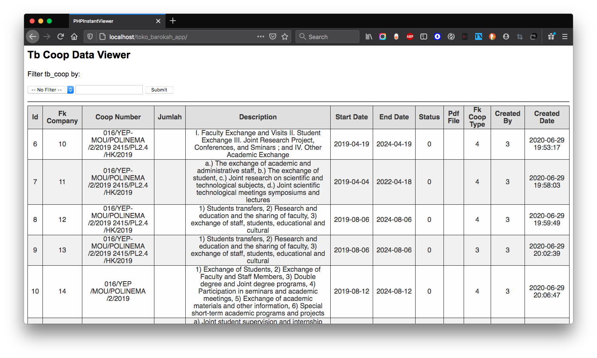

# PHPInstantViewer
Quickly show records from a table in a database as a simple web page with filter.



Choose any table you want in your MySQL server to be shown as a simple PHP web page in a few minutes.

### Quick Setup ###
1. Clone or download this repository to your htdocs folder. Yo may rename the folder into whatever you want.
2. Edit **index.php** file, change the variables in the beginning of the file to reflect your database settings:
   ```php
   $mysqlHost = 'Your MySQL Host';
   $user = 'Your MySQL Username';
   $password = 'Your MySQL Password';
   $dbName = 'The database containing table you want show as web page';
   $tableName = 'The table you want to show as web page';
   ```
3. Activate your PHP server, and as long as the database settings are correct, the content of the table will be shown in the browser once you type its URL.
